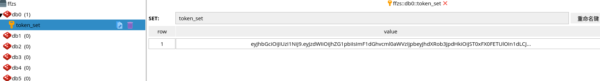

# Spring WebFlux (9):  配合redis使用

redis是著名的缓存数据库，同时也是Key-Value数据库，使用redis可以做许多工作，共享session，实现一个小的队列，最主要还用来作为缓存。

在webflux中使用redis用于缓存有些蛋疼，需要自己配置，而且返回的都是`publisher`，本篇也不着重实现这个，本篇只是在[Spring WebFlux (7): Springboot Security+jwt登录鉴权](https://blog.csdn.net/tonydz0523/article/details/108065025)

的基础上，添加一些redis的使用：

+ 登录的时候将token记录在redis数据库中key为`token_set`的一个set中
+ 访问的时候，通过判断该token是否在redis的该set中，如果不在则访问失败

设想功能：

+ 退出登录时，将token从set中删掉
+ 如果作为网关，还可以在登录的时候将每一个权限开放的路由地址都进行缓存，访问的时候，对比解析出的用户权限，查看访问的路由是否在这些权限允许的路由之中，如果不在直接返回，就不用放行到资源服务器

## 示例

对[Spring WebFlux (7): Springboot Security+jwt登录鉴权](https://blog.csdn.net/tonydz0523/article/details/108065025)项目进行更改

+ 添加一个`RedisService`类，添加`saveToken`用于存储token到redis中
+ `JwtWebFilter`中添加查看token是否在redis数据库中

### 1. RedisService类

+ 注意一点redisTemplate运行返回的是Mono或是Flux，需要通过subscribe使用，不然的话没有执行，数据库中不会有内容。

```java
/**
 * @author: ffzs
 * @Date: 2020/8/20 下午3:30
 */

@Service
@AllArgsConstructor
@Slf4j
public class RedisService {
    private final ReactiveRedisTemplate<String, String> redisTemplate;

    public void saveToken (String token) {
        redisTemplate.opsForSet().add("token_set", token)
                .subscribe();
    }
}
```

### 2.  改写login的controller

+ 基本也没有什么修改的，执行一下保存token的方法就行`redisService.saveToken(token);`

```java
@PostMapping("login")
public Mono<HttpResult> login (@RequestBody Map<String, String> user) {

    return Mono.justOrEmpty(user.get("username"))
            .flatMap(myUserRepository::findByUsername)
            .filter(it -> password.matches(user.get("password"), it.getPassword()))
            .map(it -> {
                    List<String> roles = it.getAuthorities().stream().map(GrantedAuthority::getAuthority).collect(Collectors.toList());
                    String token = jwtSigner.generateToken(it);
                    redisService.saveToken(token);
                    return new HttpResult(HttpStatus.OK.value(), "成功登录", new LoginResponse(it.getUsername(), roles.toString(), token));
                }
            )
            .onErrorResume(e -> Mono.empty())
            .switchIfEmpty(Mono.just(new HttpResult(HttpStatus.UNAUTHORIZED.value(), "登录失败", null)));
}
```

### 3.  JwtWebFilter改写

+ 主要添加一个检查token是否在redis中

```java
/**
 * @author: ffzs
 * @Date: 2020/8/17 下午12:53
 */

@Component
@Slf4j
@AllArgsConstructor
public class JwtWebFilter implements WebFilter {

    private final JwtSigner jwtSigner;
    private final ReactiveRedisTemplate<String, String> reactorTemplate;

    protected Mono<Void> writeErrorMessage(ServerHttpResponse response, HttpStatus status, String msg) {
        response.getHeaders().setContentType(MediaType.APPLICATION_JSON);
        ObjectMapper mapper=new ObjectMapper();
        String body;
        try{
            body = mapper.writeValueAsString(new HttpResult(status.value(), msg, null));
        } catch (JsonProcessingException e) {
            return Mono.error(e);
        }
        DataBuffer dataBuffer = response.bufferFactory().wrap(body.getBytes(StandardCharsets.UTF_8));
        return response.writeWith(Mono.just(dataBuffer));
    }

    @SneakyThrows
    @Override
    public Mono<Void> filter(ServerWebExchange exchange, WebFilterChain chain) {
        ServerHttpRequest request = exchange.getRequest();
        ServerHttpResponse response = exchange.getResponse();
        String path = request.getPath().value();
        if (path.contains("/auth/login") || path.contains("/auth/signout")) return chain.filter(exchange);
        String auth = request.getHeaders().getFirst(HttpHeaders.AUTHORIZATION);
        if (auth == null) {
            return this.writeErrorMessage(response, HttpStatus.NOT_ACCEPTABLE, "没有携带token");
        }
        else if (!auth.startsWith(jwtSigner.getTokenPrefix())) {
            return this.writeErrorMessage(response, HttpStatus.NOT_ACCEPTABLE, "token 没有以" + jwtSigner.getTokenPrefix() + "开始");
        }

        String token = auth.substring(jwtSigner.getTokenPrefix().length());

        return reactorTemplate.opsForSet().isMember("token_set", token)
                .flatMap(isMember -> {
                    if (isMember) {
                        try {
                            exchange.getAttributes().put("token", token);
                            return chain.filter(exchange);
                        } catch (Exception e) {
                            return this.writeErrorMessage(response, HttpStatus.INTERNAL_SERVER_ERROR, e.getMessage());
                        }
                    }
                    else {
                        return this.writeErrorMessage(response, HttpStatus.UNAUTHORIZED, "非法token，没有发布过改token");
                    }
                });
    }
}
```

### 4. 测试

+ 输入不正确的token


+ redis数据




## 代码：

[github](https://github.com/ffzs/webflux_jwt_redis)
[gitee](https://gitee.com/ffzs/webflux_jwt_redis)